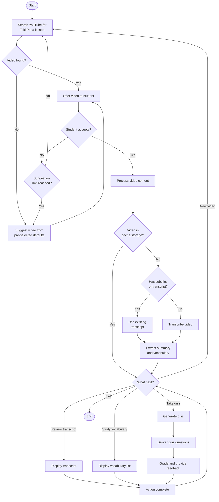

# Agentic Workflow

This agent helps students learn Toki Pona (a minimalist constructed language) through YouTube videos by providing search, transcription, summarization, vocabulary extraction, and quiz functionalities. It features:

- function calling (e.g., data fetching, taking actions)
- structured outputs (e.g., JSON schema, Pydantic models)
- state management (e.g., finite state machines)
- user interfaces (e.g., command-line interfaces)

This is a work in progress.

## Setup

```bash
python -m venv .venv
source .venv/bin/activate
python -m pip install -e .
```

## Usage

```bash
python main.py
```

## Key Components

1. Video Search & Selection

    - Searches YouTube for Toki Pona lessons
    - Offers recommendations and alternatives
    - Falls back to pre-selected videos if needed

2. Content Processing

    - Retrieves or generates transcripts
    - Summarizes video content
    - Extracts key vocabulary and phrases

3. Learning Assessment

    - Creates quizzes based on video content
    - Provides feedback on student responses
    - Adjusts difficulty based on performance

4. Navigation Controls

    - Gives students clear options at each step
    - Always provides an option to exit current activity
    - Avoids loops by limiting recommendation cycles

## Flowchart



## Implementation Considerations

1. System Architecture

    - Command-Line Interface (CLI): Create a text-based interface that's easy to navigate with simple commands.
    - Modular Design: Separate functionality into modules (search, processing, quiz) for easier maintenance.
    - State Management: Track user progress and history across sessions.

2. Key Technical Components

    - YouTube API Integration: For searching videos and retrieving metadata.
    - Speech-to-Text: For transcribing videos that lack subtitles.
    - Natural Language Processing: For summarization and vocabulary extraction.
    - Database: To cache transcripts and vocabulary to avoid redundant processing.

3. User Experience Considerations

    - Progressive Disclosure: Start simple and reveal more advanced options as the student progresses.
    - Clear Navigation: Always show available options and how to access them.
    - Feedback Loop: Gather student feedback on video quality and quiz difficulty.

4. Enhancement Ideas

    - Difficulty Levels: Tag videos and quizzes with beginner/intermediate/advanced ratings.
    - Spaced Repetition: Schedule review of previously learned vocabulary.
    - Learning Path: Suggest logical progression of videos based on content.
    - Translation Practice: Incorporate translation exercises in both directions.

5. Potential Challenges

    - YouTube API Limitations: Managing rate limits and content restrictions.
    - Transcription Accuracy: Ensuring quality for videos with poor audio.
    - Content Availability: Finding enough high-quality Toki Pona videos.
    - Quiz Generation: Creating meaningful assessments from video content.

## Prototype Plan

### Implementation Notes for Prototyping

1. Start with Mock Data: Using hardcoded responses for YouTube searches and transcripts speeds up initial testing.
2. Minimal Dependencies: For quick prototyping, minimize external dependencies.
3. Simple Session Storage: Use in-memory storage initially rather than databases.
4. Progressive Enhancement:
    - First test with mock functions
    - Then integrate real YouTube API
    - Finally add transcript processing

### Fastest Path to Proof of Concept

The command-line approach is the quickest way to prove the concept. The process would be:

1. Implement the CLI prototype with mock functions
2. Test various conversation flows
3. Replace mock functions with real API implementations once the flow works
4. Gather feedback and iterate

With this approach, we could have a working prototype in a day or two, allowing us to validate the concept before investing in a full UI implementation.
