# Toki Pona Learning Assistant

An AI-powered learning assistant that helps users learn Toki Pona through YouTube videos. This application uses Claude, YouTube's Data API, and transcript analysis to create an interactive learning experience. 

## 🎥 Demo Video

[](https://youtu.be/xC_Jz2w1TTM)

## 🌟 Features

- **Video Discovery**: Search for Toki Pona learning videos on YouTube
- **Content Analysis**: Automatically extract transcripts and analyze content
- **Vocabulary Extraction**: Identify and define Toki Pona words from videos
- **Interactive Quizzes**: Generate customized quizzes based on video content
- **Guided Learning Flow**: Follow a structured learning workflow
- **Conversational Interface**: Natural language interaction with the assistant

## 📋 Prerequisites

- Python 3.8+
- Anthropic API key (for Claude)
- YouTube Data API key
- Internet connection for API access

## 🚀 Installation

1. Clone the repository:

   ```bash
   git clone https://github.com/dr-rompecabezas/free-genai-bootcamp-2025
   cd free-genai-bootcamp-2025/agentic-workflow
   ```

2. Create a virtual environment:

   ```bash
   python -m venv venv
   source venv/bin/activate
   ```

3. Install dependencies:

   ```bash
   pip install -r requirements.txt
   ```

4. Set up environment variables:

   ```bash
   cp .env.template .env
   ```

   Then edit the `.env` file to add your API keys:

   ```text
   ANTHROPIC_API_KEY=your_anthropic_api_key_here
   YOUTUBE_API_KEY=your_youtube_api_key_here
   ```

## 💻 Usage

Start the application:

```bash
python main.py
```

### Learning Flow

1. **Search for Videos**: Ask the assistant about specific Toki Pona topics

   ```text
   "I want to learn about Toki Pona numbers"
   ```

2. **Select a Video**: Choose from suggested videos

   ```text
   "Let's watch the second video"
   ```

3. **Study Content**: The assistant will process the video and offer options

   ```text
   "Show me the vocabulary from this video"
   ```

4. **Take Quizzes**: Test your knowledge

   ```text
   "Generate a beginner quiz about this lesson"
   ```

5. **Continue Learning**: Move to another topic or video

   ```text
   "I want to learn about particles next"
   ```

## 🔍 How It Works

The application follows a semi-structured workflow:

```mermaid
sequenceDiagram
    participant Student
    participant Assistant
    participant YouTube
    participant Transcripts
    participant Learning Tools

    Student->>Assistant: Ask about Toki Pona topic
    Assistant->>YouTube: Search for relevant videos
    YouTube-->>Assistant: Video search results
    
    Assistant->>Student: Present curated video options
    Student->>Assistant: Select a video
    
    Assistant->>YouTube: Retrieve video content
    YouTube-->>Assistant: Video metadata
    
    Assistant->>Transcripts: Obtain/generate transcript
    Note over Transcripts: Uses tiered approach<br/>(API → Speech Recognition → AI)
    Transcripts-->>Assistant: Processed transcript
    
    Assistant->>Learning Tools: Extract vocabulary
    Learning Tools-->>Assistant: Vocabulary list with definitions
    
    Assistant->>Student: Video summary & learning options
    
    rect rgb(240, 240, 240)
    Note right of Student: Learning Activities
    Student->>Assistant: Request transcript review
    Student->>Assistant: Study vocabulary
    Student->>Assistant: Take generated quiz
    end
    
    Student->>Assistant: Request new topic
    Note over Student,Assistant: Learning cycle continues
```



1. The user requests learning content
2. The assistant searches YouTube for relevant videos
3. After selecting a video, the assistant:
   - Retrieves the video transcript
   - Extracts Toki Pona vocabulary
   - Creates a learning summary
4. The user can:
   - Review the transcript
   - Study extracted vocabulary
   - Take generated quizzes
   - Request new videos

## 📁 Project Structure

```text
toki-pona-assistant/
├── main.py              # Main application file
├── youtube_functions.py # YouTube API integration
├── requirements.txt     # Dependencies
├── .env.template        # Environment variable template
└── README.md            # This file
```

## 🛠️ Technologies Used

- **Anthropic Claude**: Powers the conversational AI assistant
- **YouTube Data API**: Searches and retrieves video information
- **YouTube Transcript API**: Extracts video transcripts
- **Python**: Core programming language
- **AsyncIO**: Handles asynchronous operations

## ✨ Learning Features

### Transcript Generation

The assistant uses a tiered approach to ensure transcripts are available for all videos:

1. **Official Transcripts**: First attempts to retrieve official YouTube transcripts
2. **Speech Recognition**: If no transcript exists, downloads audio and converts to text
3. **AI Generation**: As a last resort, generates educational content based on video metadata

All generated transcripts are clearly marked so users know their source.

### Vocabulary Extraction

The assistant automatically identifies Toki Pona words in video transcripts and provides:

- Word definitions
- Example usage from the video
- Context for deeper understanding

### Quiz Generation

Generates quizzes at three difficulty levels:

- **Beginner**: Basic vocabulary and simple sentence structure
- **Intermediate**: Translations and fill-in-the-blank exercises
- **Advanced**: Complex sentences, idioms, and original sentence creation

## 📜 License

This project is licensed under the MIT License - see the LICENSE file for details.

## 🙏 Acknowledgments

- Thanks to the Toki Pona community for creating learning resources
- Anthropic for Claude API
- YouTube for providing access to educational content

## 📚 About Toki Pona

Toki Pona is a minimalist constructed language created by linguist Sonja Lang. It has around 120-130 words and uses simple grammatical structures, making it an interesting language to learn and study.
